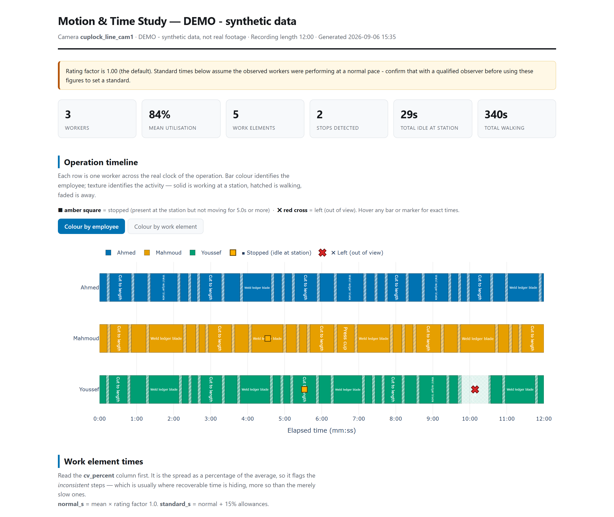

# motion-study

Video-based **motion and time study** for assembly and fabrication lines. Drop in a video of a
production operation, run one command, get an interactive report: per-worker processing times,
work elements across the operation timeline, detected stops and departures, cycle times, labour
balance and movement paths.

It does not rate the worker. That is the point.

## Why it refuses to rate

A time study has two halves. The first is observation — what happened, when, for how long, in what
order. The second is **performance rating**: the analyst's judgement that the operator was working
at, say, 95% of a normal pace, which converts an observed time into a standard time.

This system does the first half and refuses the second, permanently.

- **It cannot see effort.** A camera can measure that a worker's hands were still for 4.2 seconds.
  It cannot see whether they were catching their breath, waiting on an upstream machine, thinking
  through a fixture, or coasting. Every one of those looks identical in pixels, and they mean
  entirely different things to a standard time.
- **A rating is a contested number, and contested numbers need an owner.** Standard times set
  targets, and targets are argued about — by supervisors, by operators, sometimes by a union. A
  rating attributable to a named industrial engineer can be challenged, explained, and revised. A
  rating attributable to "the software" cannot be challenged, only resented.
- **The failure mode should be a visible gap, not a confident number.** So you supply the rating
  factor, and every report prints the value used, on the face of it. A reader can always see which
  human judgement the standard time rests on.

The machine's job is narrowed to the thing it is actually reliable at: watching a long video without
getting bored, and counting. The judgement that carries consequence stays with a person.

There is a second refusal worth stating plainly. This is a **process** measurement tool. It reports
on stations, elements and cycles. It is not built to produce per-person productivity league tables,
and using it that way will make the next study impossible — the cooperation you need to mount a
camera in a workshop is not recoverable once people conclude they are being scored.

## See it before filming anything

```bash
python -m mstudy demo
```

Builds a complete report from a synthetic three-worker line — no video, no models, no GPU, no
network. Opens at `runs/demo/report.html`.



*The banner at the top of every report is not decoration — it is the rating factor the standard times
rest on, printed where a reader cannot miss it. Below the timeline the report continues with work
element statistics, a Standard Work Combination Table, a Yamazumi balance chart and a spaghetti
diagram.*

## Install

Python 3.11 or newer. From the repository root:

```bash
python -m venv .venv
source .venv/bin/activate        # Windows: .venv\Scripts\activate
pip install -e .
```

That is everything `python -m mstudy demo` needs. Model weights (~40 MB) download automatically the
first time you process an actual video, and are cached afterwards.

One platform note, because it costs an hour to work out: **on Windows-on-ARM, use an x64 Python.**
`opencv-python` publishes no Windows-ARM64 wheel, so a native-ARM64 interpreter falls back to
building OpenCV from source and fails on the missing Visual Studio toolchain. The x64 build runs
fine under emulation. Linux, macOS and Windows x64 need nothing special.

To run a real study, copy `configs/example_line.yaml`, edit the stations and takt time for your
line, draw the zones once, then run it:

```bash
cp configs/example_line.yaml configs/cutting_line.yaml
python -m mstudy zones  input/cutting_line.mp4 -c configs/cutting_line.yaml
python -m mstudy run    input/cutting_line.mp4 -c configs/cutting_line.yaml
```

See **[docs/RUNBOOK.md](docs/RUNBOOK.md)** for how to film, run and validate — read the filming
section before recording anything, because camera discipline decides the accuracy of this system
more than any setting inside it.

## What it produces

Per video, in `runs/<video-name>/`:

| File | What it is |
|---|---|
| `report.html` | The deliverable. Self-contained, opens offline. |
| `steps.txt` | Plain-text breakdown: every step, in order, with its time. |
| `segments.csv` | Every worker/activity/start/end/duration — pivot this in Excel. |
| `standard_work_combination.csv` | SWCT rows: manual / auto-wait / walk per element. |
| `stops.csv`, `cycles.csv`, `step_statistics.csv`, `worker_statistics.csv` | Raw tables. |
| `events.jsonl` | Machine-readable event stream. |
| `annotated.mp4` | The video with names, steps and a clock burned in (optional). |
| `tracks.parquet` | Raw detections — re-run the analysis without re-processing the video. |
| `run.json` | Config fingerprint and versions, so any report can be reproduced. |

The report contains a multi-worker **Gantt chart** (colour per employee, **■** = stopped,
**✖** = left), a **Standard Work Combination Table** per operator (manual / auto-wait / walk against
takt), work-element statistics with spread, a **Yamazumi** labour-balance chart, and a **spaghetti**
movement diagram.

```bash
python -m mstudy steps input/cutting_line.mp4   # after the demo, try: mstudy steps demo
```

Prints the text breakdown — every step each worker performed, in order, with its start time,
duration, and any stop inside it.

## How it works

```
video ─► detect (YOLOX) ─► track (ByteTrack) ─► name workers
                                                     │
              zones you drew once ──────────────────►┤
                                                     ▼
                              steps · stops · departures · cycles
                                                     ▼
                                    report.html + annotated.mp4
```

A worker's **step** is the station zone they are standing in. A **stop** is hand and forearm
movement below a threshold while at a station — measured in body-heights per second, so it works the
same near and far from the camera. A **departure** is being outside every zone, or out of frame.

Each stage writes a file the next one reads, so changing a threshold or a chart rebuilds in seconds
instead of reprocessing the video.

### What is validated, and what is not

Worth being exact about, because the two halves of the pipeline have very different evidence behind
them:

- **The analysis half is validated against ground truth.** `tests/test_demo_accuracy.py` generates
  synthetic tracks whose stops, departures, element times and cycle times are known exactly, then
  asserts the pipeline recovers them. When the segmentation, stop detection or cycle maths is wrong,
  those tests fail.
- **The detection half is not.** Detection and tracking accuracy on real workshop footage — how
  often YOLOX misses a worker behind a rack, how often ByteTrack swaps two identities — has not been
  measured against a hand-labelled video. That is the honest state of it.

Which is why the RUNBOOK's ±5% stopwatch check is not optional ceremony. Time a few cycles by hand
and compare them against the report before anyone sets a target from it.

## Licensing: nothing here is AGPL

**There is no AGPL and no GPL anywhere in this project's dependency tree.** That is verified, not
assumed: the claim was checked by resolving the full tree — 49 packages including transitive
dependencies — and reading each one's declared licence. The strongest copyleft present is MPL-2.0,
in `certifi` and `tqdm`, which is file-level and reaches neither this project nor yours. Everything
else is Apache-2.0, MIT, BSD, PSF, ISC or MIT-CMU. There is no PyTorch.

The direct dependencies:

| Component | Licence |
|---|---|
| [rtmlib](https://github.com/Tau-J/rtmlib) — YOLOX detection + RTMPose | Apache-2.0 |
| [trackers](https://github.com/roboflow/trackers) — ByteTrack | Apache-2.0 |
| [supervision](https://github.com/roboflow/supervision) | MIT |
| ONNX Runtime · Plotly · PyYAML · Typer · Rich | MIT |
| OpenCV · PyArrow | Apache-2.0 |
| NumPy · pandas · Jinja2 | BSD |
| **motion-study itself** | **Apache-2.0** |

This is a deliberate constraint, and it is the practical reason to choose this over a weekend
project built on the usual stack.

Most computer-vision tooling reaches for Ultralytics YOLO by default. Ultralytics is **AGPL-3.0**:
if you build on it, the AGPL's network clause means distributing *or operating* the derivative work
obliges you to release your whole source under AGPL-3.0 as well — or to buy an Enterprise licence.
For a manufacturer, that is not a licensing footnote. It means the internal tooling wrapped around
it, and potentially the systems it talks to, land in front of legal before anything can be deployed,
and the usual answer is no.

Avoiding it costs a little accuracy at the detection step and buys the ability to actually put this
into a plant. `rtmlib` gives Apache-2.0 YOLOX and RTMPose weights over ONNX Runtime, which also
happens to mean CPU-only inference works without a GPU budget.

## Development

```bash
pip install -e ".[dev]"
pytest tests -q
```

71 tests, no video or model weights required. CI runs them on Python 3.11 and 3.12 on every push and
pull request.

## What this is not

Not a rating system, not a productivity monitor, and not a system of record for anyone's
performance. It is a measuring instrument for a process, and it is only as defensible as the human
judgement you attach to its output.

Footage of identifiable workers never leaves the machine that processes it: `input/` and `runs/` are
gitignored, nothing is uploaded, and no model call leaves the host.

## License

Apache-2.0 — see [LICENSE](LICENSE).
